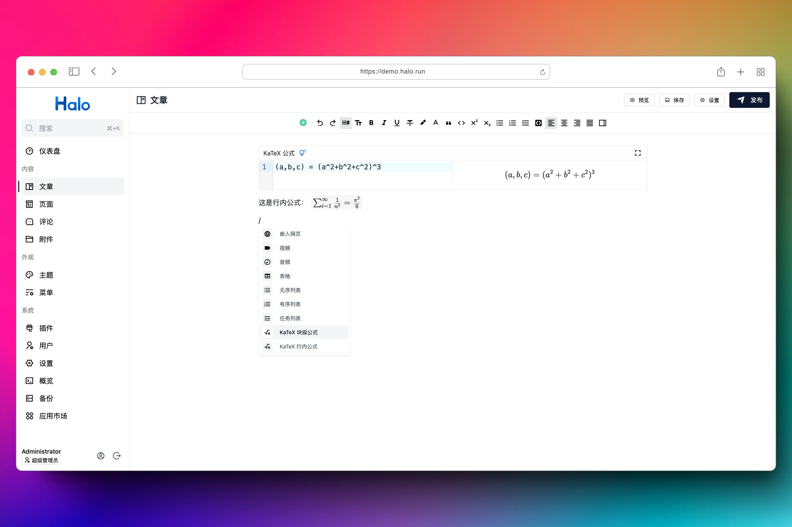

# plugin-kmath

为默认编辑器和文章渲染提供数学公式支持（KaTeX / MathJax）。



## 使用方式

1. 下载，目前提供以下两个下载方式：
    - GitHub Releases：访问 [Releases](https://github.com/Akvicor/plugin-kmath/releases) 下载 Assets 中的 JAR 文件。
    - Halo 应用市场：<https://halo.run/store/apps/app-szrtpwd9>。
2. 安装，插件安装和更新方式可参考：<https://docs.halo.run/user-guide/plugins>。

## 用法说明

### 配置项说明

1. KaTeX 输出格式（`katex_output`）

   支持三种输出格式：

    - `mathml`：输出 MathML 结构。
    - `html`：输出 HTML 结构。
    - `htmlAndMathml`：同时输出 HTML + MathML。

   插件默认值为：`mathml`。

   实际生效范围：

    - 控制台默认编辑器在使用 KaTeX 引擎时的渲染输出。
    - 前台在使用 KaTeX 引擎并执行客户端渲染时的输出结构。

2. 前台渲染引擎（`render_engine`）

   可选 `katex` / `mathjax`，用于控制控制台默认编辑器和前台客户端渲染时使用的引擎。

   说明：

    - 该配置会影响控制台默认编辑器中的预览与保存内容的渲染结构。
    - 当 `enable_frontend_render=false` 时，不执行前台客户端二次渲染流程。
    - 即使不执行二次渲染，仍会根据引擎注入对应的基础样式（KaTeX CSS 或 MathJax SVG 样式）。

3. 启用客户端公式渲染（`enable_frontend_render`）

    - `false`：不注入前台渲染脚本。
    - `true`：按下述选择器查找公式节点，并使用 `render_engine` 在前台渲染。

4. 行内公式 CSS 选择器（`inline_selector`）

    CSS Selector 语法，用于查找前台待渲染的行内公式 DOM。

    默认值：`[math-inline],.katex-inline`

    已知编辑器：

    [ByteMD](https://www.halo.run/store/apps/app-HTyhC)：`.math-inline`

    [StackEdit](https://www.halo.run/store/apps/app-hDXMG)：`.katex--inline`

    如同时使用多个编辑器，CSS Selector 之间用 `,` 隔开即可。

    如：`[math-inline],.math-inline,.katex--inline`

5. 块级公式 CSS 选择器（`display_selector`）

    CSS Selector 语法，用于查找前台待渲染的块级公式 DOM。

    默认值：`[math-display],.katex-block`

    已知编辑器：

    [ByteMD](https://www.halo.run/store/apps/app-HTyhC)：`.math-display`

    [StackEdit](https://www.halo.run/store/apps/app-hDXMG)：`.katex--display`

### 在默认编辑器中使用

1. 方式一：在默认编辑器中，使用 `$` 开头和结尾的语句将会被渲染为 KaTeX 行内公式，输入 `$$` 并回车可以插入 KaTeX 块级公式。
2. 方式二：在编辑器顶部工具栏的工具箱中点击 **KaTeX 块级公式** 或者 **KaTeX 行内公式** 即可插入块级公式和行内公式。
3. 方式三：在指令菜单（/）中选择 **KaTeX 块级公式** 或者 **KaTeX 行内公式** 即可插入块级公式和行内公式。

在默认编辑器中使用，编辑器将会自动生成相应的 DOM 结构，无需进行其他配置。

### 配置简述

1. `katex_output`：会直接影响使用 KaTeX 引擎时编辑器预览与保存内容的输出结构。
2. `render_engine`：会影响编辑器内预览、保存内容的渲染结构，以及前台页面侧的渲染链路。
3. `enable_frontend_render=false`：前台不做二次渲染；是否正常显示取决于已保存结构与当前样式支持。
4. 若希望前台强制统一为 MathJax 效果：设置 `render_engine=mathjax` 且 `enable_frontend_render=true`。

## 开发环境

```bash
git clone git@github.com:Akvicor/plugin-kmath.git

# 或者当你 fork 之后

git clone git@github.com:{your_github_id}/plugin-kmath.git
```

```bash
cd path/to/plugin-kmath
```

```bash
# macOS / Linux
./gradlew pnpmInstall

# Windows
./gradlew.bat pnpmInstall
```

### 使用 Halo Server 运行（需 Docker 环境）

```bash
# macOS / Linux
./gradlew haloServer

# Windows
./gradlew.bat haloServer
```

### 使用 Halo Dev 运行

```bash
# macOS / Linux
./gradlew build

# Windows
./gradlew.bat build
```

修改 Halo 配置文件：

```yaml
halo:
    plugin:
        runtime-mode: development
        classes-directories:
            - "build/classes"
            - "build/resources"
        lib-directories:
            - "libs"
        fixedPluginPath:
            - "/path/to/plugin-kmath"
```
